# Patexia Legal AI Chatbot

[](https://www.python.org/downloads/)
[](https://fastapi.tiangolo.com/)
[](https://docs.docker.com/compose/)
[](LICENSE)

A production-ready AI-powered legal document intelligence system designed for case-based document management, semantic search, and intelligent legal text analysis. Built with modern async Python architecture and state-of-the-art AI models.

## 🎯 Executive Overview

**Transform Legal Document Review**: Convert hours of manual document analysis into seconds of intelligent search and retrieval, enabling lawyers to focus on legal strategy rather than document hunting.

### Key Benefits
- **10x Faster Document Discovery**: Semantic search finds relevant documents in seconds vs. hours of manual review
- **Intelligent Case Organization**: AI-powered case summaries and document relationships provide instant case context
- **Multi-User Collaboration**: Multiple lawyers can work simultaneously on different cases with real-time updates
- **Compliance-Ready Citations**: Every AI response includes proper source attribution for legal documentation

## 🏗️ System Architecture

### High-Level Architecture

```mermaid
graph TB
    subgraph "Client Layer"
        UI[Gradio Web Interface]
        subgraph "UI Components"
            Sidebar[Case Navigation Sidebar]
            SearchPane[Search Results Pane]
            DocViewer[Document Viewer Pane]
            AdminPanel[Admin Config Panel]
        end
    end

    subgraph "API Gateway Layer"
        FastAPI[FastAPI Backend Server]
        subgraph "API Endpoints"
            CaseAPI[Case Management API]
            DocAPI[Document Upload API]
            SearchAPI[Search & Query API]
            WSManager[WebSocket Manager]
        end
    end

    subgraph "Business Logic Layer"
        subgraph "Core Services"
            CaseService[Case Management Service]
            DocService[Document Processing Service]
            SearchService[Search & Retrieval Service]
        end
        
        subgraph "AI Processing Pipeline"
            LlamaIndex[LlamaIndex Framework]
            PDFProcessor[PDF Text Extraction]
            Chunker[Semantic Chunking Engine]
            EmbedGen[Embedding Generation]
        end
    end

    subgraph "Model Management Layer"
        Ollama[Ollama Model Server]
        subgraph "AI Models"
            MXBai[mxbai-embed-large<br/>Primary Embedding]
            Nomic[nomic-embed-text<br/>Fallback Embedding]
            Llama3[Llama 3.1 8B<br/>Text Generation]
        end
    end

    subgraph "Data Storage Layer"
        MongoDB[Document Storage<br/>Cases & Metadata]
        Weaviate[Vector Storage<br/>Embeddings & Search]
        Neo4j[Graph Storage<br/>Document Relationships]
    end
```



### Core Architecture Principles

1. **Case-Centric Design**: Each legal case operates as an isolated workspace with dedicated document collections
2. **Hybrid Intelligence**: Combines semantic understanding with keyword precision for optimal legal document search
3. **Real-Time Responsiveness**: WebSocket architecture provides live progress tracking and instant updates
4. **Scalable Multi-Tenancy**: Per-case isolation with concurrent processing for multiple users

## 🚀 Tech Stack

### Backend Framework
- **FastAPI 0.110.0**: High-performance async API server with automatic OpenAPI documentation
- **Python 3.13**: Latest stable Python with enhanced async capabilities
- **Uvicorn**: ASGI server with auto-reload and performance optimization

### AI/ML Stack
- **LlamaIndex 0.10.0**: Advanced RAG framework for document processing and querying
- **Ollama 0.1.32**: Local model management with GPU acceleration
- **mxbai-embed-large**: State-of-the-art 1000-dimensional embeddings for legal documents
- **nomic-embed-text**: Reliable 768-dimensional fallback embeddings
- **Llama 3.1 8B**: Text generation model for legal document creation

### Database Architecture
- **MongoDB 7.0**: Document storage for cases, metadata, and search history
- **Weaviate 1.23.0**: Vector database with hybrid search capabilities
- **Neo4j 5.15.0**: Graph database for document relationship mapping (Phase 2)

### Infrastructure
- **Docker Compose**: Container orchestration with GPU support
- **Gradio 4.15.0**: Rapid prototyping web interface for legal professionals
- **WebSocket**: Real-time bidirectional communication for progress tracking

### Hardware Requirements
- **OS**: Ubuntu 24.04 LTS
- **GPU**: NVIDIA H100 (80GB) or equivalent with CUDA 12.0+
- **Storage**: 500GB SSD/NVMe for models and document processing
- **Memory**: 32GB+ RAM recommended for concurrent operations

## 📂 Project Structure

```
patexia-legal-ai/
├── backend/                    # FastAPI backend services
│   ├── main.py                # Application entry point
│   ├── config/                # Configuration management
│   │   ├── settings.py        # Pydantic settings with hot-reload
│   │   └── *.json            # Environment-specific configs
│   └── app/
│       ├── api/              # API layer
│       │   ├── routes/       # REST endpoints
│       │   ├── deps.py       # Dependency injection
│       │   └── middleware/   # CORS, logging, error handling
│       ├── core/             # Core infrastructure
│       │   ├── database.py   # Database connections
│       │   ├── ollama_client.py # Model management
│       │   └── websocket_manager.py # Real-time communication
│       ├── services/         # Business logic layer
│       │   ├── document_service.py # Document processing pipeline
│       │   ├── search_service.py   # Hybrid search engine
│       │   └── case_service.py     # Case management
│       ├── repositories/     # Data access layer
│       │   ├── mongodb/      # Document persistence
│       │   ├── weaviate/     # Vector operations
│       │   └── neo4j/        # Graph relationships
│       ├── processors/       # AI processing pipeline
│       │   ├── document_processor.py # LlamaIndex integration
│       │   ├── pdf_processor.py     # PDF text extraction
│       │   └── embedding_processor.py # Vector generation
│       └── models/           # Data models
│           ├── domain/       # Business logic models
│           ├── database/     # Database schemas
│           └── api/          # API request/response schemas
├── frontend/                 # Gradio web interface
│   ├── main.py              # UI entry point
│   ├── components/          # UI components
│   └── utils/               # Client-side utilities
├── docs/                    # Comprehensive documentation
│   ├── architecture/        # System design specifications
│   ├── deployment/          # Setup and deployment guides
│   └── user-guides/         # End-user documentation
├── scripts/                 # Automation and setup scripts
├── config/                  # Docker and deployment configs
└── tests/                   # Test suites and benchmarks
```

## ⚡ Quick Start

### Prerequisites
```bash
# Install Docker and Docker Compose
curl -fsSL https://get.docker.com | sh
sudo usermod -aG docker $USER

# Install NVIDIA Container Toolkit
distribution=$(. /etc/os-release;echo $ID$VERSION_ID)
curl -fsSL https://nvidia.github.io/libnvidia-container/gpgkey | sudo gpg --dearmor -o /usr/share/keyrings/nvidia-container-toolkit-keyring.gpg
curl -s -L https://nvidia.github.io/libnvidia-container/$distribution/libnvidia-container.list | \
    sed 's#deb https://#deb [signed-by=/usr/share/keyrings/nvidia-container-toolkit-keyring.gpg] https://#g' | \
    sudo tee /etc/apt/sources.list.d/nvidia-container-toolkit.list
sudo apt-get update && sudo apt-get install -y nvidia-container-toolkit
sudo systemctl restart docker
```

### Installation & Setup
```bash
# Clone the repository
git clone https://github.com/patexia/legal-ai-chatbot.git
cd legal-ai-chatbot

# Create environment configuration
cp .env.example .env
# Edit .env with your specific settings

# Start all services
make docker-up

# Verify installation
docker-compose ps
```

### First-Time Setup
```bash
# Pull AI models (requires ~15GB storage)
python scripts/pull_models.py

# Initialize databases
python scripts/init_databases.py

# Run performance tests
python scripts/performance_test.py
```

### Access Points
- **Web Interface**: http://localhost:7860
- **API Documentation**: http://localhost:8000/docs
- **Weaviate Console**: http://localhost:8080
- **MongoDB**: localhost:27017

## 🔧 Configuration

### Environment Variables
```bash
# Core Settings
ENVIRONMENT=development
DEBUG=true
LOG_LEVEL=INFO

# Database Connections
MONGODB_URL=mongodb://localhost:27017
WEAVIATE_URL=http://localhost:8080
NEO4J_URL=bolt://localhost:7687

# AI Model Configuration
OLLAMA_BASE_URL=http://localhost:11434
PRIMARY_EMBEDDING_MODEL=mxbai-embed-large
FALLBACK_EMBEDDING_MODEL=nomic-embed-text

# Performance Tuning
MAX_CONCURRENT_DOCUMENTS=5
CHUNK_SIZE=512
CHUNK_OVERLAP=50
SEARCH_TIMEOUT_SECONDS=30
```

### Hot-Reloadable Configuration
The system supports runtime configuration changes without restart:

```json
{
  "search_settings": {
    "alpha": 0.7,
    "similarity_threshold": 0.75,
    "max_results": 20
  },
  "processing_settings": {
    "chunk_size": 512,
    "chunk_overlap": 50,
    "batch_size": 10
  },
  "capacity_limits": {
    "documents_per_case": 25,
    "manual_override_enabled": true
  }
}
```

## 📊 Key Features

### Document Management
- **Case-Based Organization**: Isolated workspaces for each legal case
- **Batch Upload**: Multiple document processing with real-time progress
- **Format Support**: .txt and .pdf files with OCR capabilities
- **Capacity Management**: Configurable limits with manual override
- **Metadata Preservation**: Document hierarchy and legal citations

### Intelligent Search
- **Hybrid Search Engine**: Semantic + keyword search with reciprocal rank fusion
- **Two-Pane Interface**: Results list with integrated document viewer
- **Real-Time Highlighting**: Context-aware result highlighting
- **Advanced Filtering**: Metadata-based filters and similarity thresholds
- **Search History**: Persistent query history with quick replay

### AI-Powered Processing
- **Semantic Chunking**: Legal document structure-aware text segmentation
- **Multi-Step Reasoning**: Complex legal queries broken into sub-questions
- **Citation Tracking**: Automatic source attribution for all AI responses
- **Context Generation**: AI-generated case summaries and insights

### Real-Time Experience
- **WebSocket Integration**: Live progress tracking for all operations
- **Hot Configuration**: Runtime parameter changes without restart
- **Resource Monitoring**: Real-time GPU/CPU/Memory utilization
- **Error Recovery**: Graceful error handling with retry mechanisms

## 🔍 API Reference

### Core Endpoints

#### Case Management
```python
# Create a new case
POST /api/v1/cases/
{
  "name": "Patent Infringement Case #2024-001",
  "description": "Analysis of prior art and claim construction",
  "practice_area": "intellectual_property",
  "visual_marker": {
    "color": "blue",
    "icon": "scale"
  }
}

# Get case details
GET /api/v1/cases/{case_id}

# List all cases
GET /api/v1/cases/?skip=0&limit=20
```

#### Document Processing
```python
# Upload documents to a case
POST /api/v1/documents/upload/{case_id}
Content-Type: multipart/form-data

# Get document processing status
GET /api/v1/documents/{document_id}/status

# Bulk document operations
POST /api/v1/documents/batch-process
{
  "case_id": "case_123",
  "document_ids": ["doc_1", "doc_2", "doc_3"],
  "priority": "high"
}
```

#### Search & Retrieval
```python
# Hybrid search with configurable parameters
POST /api/v1/search/
{
  "case_id": "case_123",
  "query": "patent claim construction obviousness",
  "search_type": "hybrid",
  "alpha": 0.7,
  "max_results": 20,
  "filters": {
    "document_type": "patent",
    "date_range": {
      "start": "2020-01-01",
      "end": "2024-12-31"
    }
  }
}
```

#### WebSocket Events
```python
# Real-time progress updates
ws://localhost:8000/ws/document-processing/{user_id}

# Event types:
{
  "event": "document_processing_started",
  "data": {
    "document_id": "doc_123",
    "case_id": "case_123",
    "estimated_duration": 25
  }
}

{
  "event": "processing_progress",
  "data": {
    "document_id": "doc_123",
    "progress_percent": 45,
    "current_stage": "embedding_generation"
  }
}
```

## 🧪 Testing & Quality Assurance

### Test Suite
```bash
# Run all tests with coverage
make test

# Run specific test categories
pytest backend/tests/unit/
pytest backend/tests/integration/
pytest backend/tests/e2e/

# Performance benchmarking
python scripts/performance_test.py --documents=100 --concurrent-users=5
```

### Code Quality Tools
```bash
# Format code
make format

# Lint and type checking
make lint

# Security scanning
bandit -r backend/app/
safety check
```

### Performance Metrics
- **Document Processing**: <30 seconds per document (average)
- **Search Response Time**: <3 seconds (95th percentile)
- **Concurrent Users**: 5+ simultaneous users without degradation
- **Resource Utilization**: GPU memory <80%, system RAM <16GB

## 🚀 Production Deployment

### Docker Production Setup
```yaml
version: '3.8'
services:
  backend:
    build:
      context: .
      dockerfile: config/docker/Dockerfile.backend
    environment:
      - ENVIRONMENT=production
      - WORKERS=4
    deploy:
      resources:
        reservations:
          devices:
            - driver: nvidia
              count: 1
              capabilities: [gpu]

  nginx:
    image: nginx:alpine
    ports:
      - "80:80"
      - "443:443"
    volumes:
      - ./config/nginx/nginx.conf:/etc/nginx/nginx.conf
      - ./ssl:/etc/nginx/ssl
```

### Monitoring & Observability
```bash
# System monitoring
htop
nvidia-smi
docker stats

# Application metrics
curl http://localhost:8000/health
curl http://localhost:8000/metrics

# Log aggregation
docker-compose logs -f backend
tail -f logs/app.log
```

### Backup Strategy
```bash
# Automated daily backups
crontab -e
0 2 * * * /path/to/scripts/backup_data.py

# Manual backup
python scripts/backup_data.py --full-backup
```

## 🔧 Advanced Configuration

### Model Management
```python
# Switch embedding models at runtime
PUT /api/v1/admin/models/embedding
{
  "model_name": "nomic-embed-text",
  "verify_compatibility": true
}

# Model performance optimization
{
  "ollama_settings": {
    "num_ctx": 2048,
    "num_gpu": 1,
    "num_thread": 8,
    "repeat_penalty": 1.1
  }
}
```

### Search Optimization
```python
# Fine-tune search parameters
{
  "vector_search": {
    "ef": 64,
    "max_connections": 16,
    "similarity_threshold": 0.75
  },
  "keyword_search": {
    "k1": 1.2,
    "b": 0.75,
    "boost_fields": {
      "title": 2.0,
      "headers": 1.5,
      "citations": 3.0
    }
  }
}
```

### Scalability Configuration
```python
# Horizontal scaling settings
{
  "processing": {
    "max_concurrent_documents": 10,
    "batch_size": 5,
    "worker_timeout": 300
  },
  "database": {
    "connection_pool_size": 20,
    "connection_timeout": 30,
    "retry_attempts": 3
  }
}
```

## 🛠️ Development Workflow

### Local Development Setup
```bash
# Install development dependencies
make dev

# Start development environment
docker-compose -f docker-compose.dev.yml up -d

# Run backend in development mode
cd backend
uvicorn main:app --reload --host 0.0.0.0 --port 8000

# Run frontend in development mode
cd frontend
python main.py
```

### Contributing Guidelines
1. **Code Style**: Black formatting, isort imports, flake8 linting
2. **Type Hints**: Full mypy type checking compliance
3. **Testing**: 90%+ test coverage for new features
4. **Documentation**: Docstrings for all public methods
5. **Performance**: Benchmark tests for critical paths

### Git Workflow
```bash
# Feature development
git checkout -b feature/document-relationship-extraction
git commit -m "feat: add document relationship extraction with confidence scoring"

# Code review process
git push origin feature/document-relationship-extraction
# Create pull request with comprehensive tests
```

## 📈 Performance Optimization

### Database Optimization
```python
# MongoDB indexing strategy
db.documents.createIndex({"case_id": 1, "status": 1})
db.documents.createIndex({"file_hash": 1}, {"unique": true})
db.search_history.createIndex({"user_id": 1, "timestamp": -1})

# Weaviate performance tuning
{
  "vectorIndexConfig": {
    "ef": 64,
    "efConstruction": 128,
    "maxConnections": 16
  }
}
```

### Caching Strategy
```python
# Redis caching for frequent queries
@cache(expire=3600)
async def get_case_summary(case_id: str) -> CaseSummary:
    # Expensive computation cached for 1 hour
    pass

# Model response caching
@cache(expire=86400)
async def get_document_embedding(text: str, model: str) -> List[float]:
    # Embedding generation cached for 24 hours
    pass
```

## 🔐 Security Considerations

### Authentication & Authorization
```python
# JWT-based authentication
from fastapi_users import FastAPIUsers
from fastapi_users.authentication import JWTAuthentication

# Role-based access control
@require_permissions(["read:cases", "write:documents"])
async def upload_document(case_id: str, current_user: User = Depends(get_current_user)):
    # Secure document upload
    pass
```

### Data Protection
- **Encryption at Rest**: MongoDB and Weaviate data encryption
- **Transport Security**: TLS 1.3 for all external communications
- **Input Validation**: Comprehensive Pydantic schema validation
- **Audit Logging**: Complete audit trail for all operations

## 🚧 Roadmap & Future Enhancements

### Phase 2: Advanced Features (Q2 2025)
- **Graph Relationships**: Neo4j integration for document relationship mapping
- **Legal Text Generation**: AI-powered brief and affidavit creation
- **Multi-modal Processing**: Image and table extraction from PDFs
- **Advanced Analytics**: Case outcome prediction and trend analysis

### Phase 3: Enterprise Features (Q3 2025)
- **Multi-Tenant Architecture**: Support for multiple law firms
- **API Integration**: Connect with existing legal software systems
- **Mobile Interface**: Responsive design for mobile legal professionals
- **Advanced Security**: RBAC, audit trails, compliance features

### Phase 4: AI Enhancement (Q4 2025)
- **Custom Model Training**: Fine-tuned models for specific legal domains
- **Multi-Language Support**: International legal document processing
- **Voice Interface**: Audio-based document querying and analysis
- **Predictive Analytics**: Case outcome modeling and risk assessment

## 📞 Support & Community

### Documentation
- **Architecture Docs**: `/docs/architecture/`
- **API Reference**: `/docs/api/`
- **User Guides**: `/docs/user-guides/`
- **Deployment Guides**: `/docs/deployment/`

### Getting Help
- **GitHub Issues**: Bug reports and feature requests
- **Discussions**: Community Q&A and best practices
- **Wiki**: Community-maintained documentation
- **Support Email**: support@patexia.com

### Contributing
We welcome contributions! Please read our [Contributing Guide](CONTRIBUTING.md) for details on:
- Code of conduct
- Development workflow
- Pull request process
- Community guidelines

## 📄 License

This project is licensed under the MIT License - see the [LICENSE](LICENSE) file for details.

---

**Built with ❤️ for the legal community by Patexia**

*Transforming legal document review through intelligent AI technology*