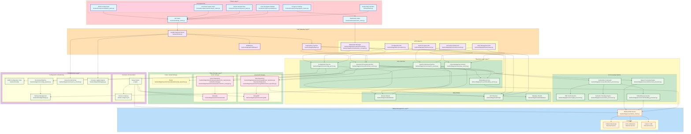

```mermaid
flowchart TB
 subgraph subGraph0["UI Components"]
        Sidebar["Case Navigation Sidebar<br>frontend/components/sidebar.py"]
        SearchPane["Search Results Pane<br>frontend/components/search_pane.py"]
        DocViewer["Document Viewer Pane<br>frontend/components/document_viewer.py"]
        AdminPanel["Admin Config Panel<br>frontend/components/admin_panel.py"]
        Progress["Progress Tracking<br>frontend/components/progress_tracker.py"]
  end
 subgraph subGraph1["**Client Layer**"]
        UI["Gradio Web Interface<br>frontend/main.py"]
        subGraph0
        WSClient["WebSocket Client<br>frontend/utils/websocket_client.py"]
        APIClient["API Client<br>frontend/utils/api_client.py"]
  end
 subgraph subGraph2["API Endpoints"]
        CaseAPI["Case Management API<br>backend/app/api/routes/cases.py"]
        DocAPI["Document Upload API<br>backend/app/api/routes/documents.py"]
        SearchAPI["Search &amp; Query API<br>backend/app/api/routes/search.py"]
        ConfigAPI["Configuration API<br>backend/app/api/routes/admin.py"]
        WSManager["WebSocket Manager<br>backend/app/api/routes/websocket.py<br>backend/app/core/websocket_manager.py"]
  end
 subgraph subGraph3["**API Gateway Layer**"]
        FastAPI["FastAPI Backend Server<br>backend/main.py"]
        subGraph2
        Deps["Dependency Injection<br>backend/app/api/deps.py"]
        Middleware["Middleware<br>backend/app/api/middleware/"]
  end
 subgraph subGraph4["Core Services"]
        CaseService["Case Management Service<br>backend/app/services/case_service.py"]
        DocService["Document Processing Service<br>backend/app/services/document_service.py"]
        SearchService["Search &amp; Retrieval Service<br>backend/app/services/search_service.py"]
        ConfigService["Configuration Service<br>backend/app/services/config_service.py"]
        EmbedService["Embedding Service<br>backend/app/services/embedding_service.py"]
  end
 subgraph subGraph5["AI Processing Pipeline"]
        LlamaIndex["LlamaIndex Framework<br>backend/app/processors/document_processor.py"]
        PDFProcessor["PDF Text Extraction<br>backend/app/processors/pdf_processor.py"]
        Chunker["Semantic Chunking Engine<br>backend/app/processors/text_processor.py"]
        EmbedGen["Embedding Generation<br>backend/app/processors/embedding_processor.py"]
        QueryEngine["Query Processing Engine<br>backend/app/processors/document_processor.py"]
  end
 subgraph subGraph6["Data Models"]
        DomainModels["Domain Models<br>backend/app/models/domain/"]
        APISchemas["API Schemas<br>backend/app/models/api/"]
        DBModels["Database Models<br>backend/app/models/database/"]
  end
 subgraph subGraph7["**Business Logic Layer**"]
        subGraph4
        subGraph5
        subGraph6
  end
 subgraph subGraph8["AI Models"]
        MXBai["mxbai-embed-large<br>External Service"]
        Nomic["nomic-embed-text<br>External Service"]
        Llama3["Llama 3.1 8B<br>External Service"]
  end
 subgraph subGraph9["**Model Management Layer**"]
        Ollama["Ollama Model Server<br>backend/app/core/ollama_client.py"]
        subGraph8
  end
 subgraph subGraph10["Document Storage"]
        MongoDB["MongoDB<br>backend/app/repositories/mongodb/"]
        MongoRepo["Case Repository<br>backend/app/repositories/mongodb/case_repository.py<br>Document Repository<br>backend/app/repositories/mongodb/document_repository.py"]
  end
 subgraph subGraph11["Vector Storage"]
        Weaviate["Weaviate<br>backend/app/repositories/weaviate/"]
        VectorRepo["Vector Repository<br>backend/app/repositories/weaviate/vector_repository.py<br>Collection Manager<br>backend/app/repositories/weaviate/collection_manager.py"]
  end
 subgraph subGraph12["Future: Graph Storage"]
        Neo4j["Neo4j<br>backend/app/repositories/neo4j/relationship_repository.py"]
  end
 subgraph subGraph13["**Data Storage Layer**"]
        subGraph10
        subGraph11
        subGraph12
  end
 subgraph subGraph14["Container Orchestration"]
        Docker["Docker Compose<br>docker-compose.yml"]
        Scripts["Setup Scripts<br>scripts/"]
  end
 subgraph subGraph15["Configuration & Monitoring"]
        ConfigFiles["JSON Configuration Files<br>backend/config/"]
        HotReload["Hot-Reload Watcher<br>backend/app/core/config_watcher.py"]
        ResourceMonitor["Resource Monitoring<br>backend/app/core/resource_monitor.py"]
        Logger["Console Logging System<br>backend/app/utils/logging.py"]
        Settings["Settings Management<br>backend/config/settings.py"]
  end
 subgraph subGraph16["**Infrastructure Layer**"]
        subGraph14
        subGraph15
  end
    UI --> APIClient
    Sidebar --> APIClient
    SearchPane --> APIClient
    DocViewer --> APIClient
    AdminPanel --> APIClient
    Progress --> WSClient
    WSClient --> WSManager
    APIClient --> FastAPI
    FastAPI --> Deps & Middleware & ResourceMonitor & Logger
    Deps --> CaseService & DocService & SearchService & ConfigService
    CaseAPI --> CaseService & APISchemas
    DocAPI --> DocService & APISchemas
    SearchAPI --> SearchService & APISchemas
    ConfigAPI --> ConfigService & APISchemas
    WSManager --> DocService & ConfigService
    CaseService --> MongoRepo & DomainModels
    DocService --> LlamaIndex & MongoRepo & VectorRepo & EmbedService & DomainModels
    SearchService --> VectorRepo & QueryEngine & EmbedService & DomainModels
    EmbedService --> Ollama
    LlamaIndex --> PDFProcessor & Chunker & EmbedGen
    EmbedGen --> Ollama
    QueryEngine --> Ollama
    Ollama --> MXBai & Nomic & Llama3
    MongoRepo --> MongoDB & DBModels
    VectorRepo --> Weaviate
    SearchService -.-> Neo4j
    DocService -.-> Neo4j
    ConfigService --> ConfigFiles & HotReload & Settings
    HotReload --> Settings
    Scripts --> Docker & MongoDB & Weaviate & Ollama
     Sidebar:::clientLayer
     SearchPane:::clientLayer
     DocViewer:::clientLayer
     AdminPanel:::clientLayer
     Progress:::clientLayer
     UI:::clientLayer
     WSClient:::clientLayer
     APIClient:::clientLayer
     CaseAPI:::apiLayer
     DocAPI:::apiLayer
     SearchAPI:::apiLayer
     ConfigAPI:::apiLayer
     WSManager:::apiLayer
     FastAPI:::apiLayer
     Deps:::apiLayer
     Middleware:::apiLayer
     CaseService:::businessLayer
     DocService:::businessLayer
     SearchService:::businessLayer
     ConfigService:::businessLayer
     EmbedService:::businessLayer
     LlamaIndex:::businessLayer
     PDFProcessor:::businessLayer
     Chunker:::businessLayer
     EmbedGen:::businessLayer
     QueryEngine:::businessLayer
     DomainModels:::businessLayer
     APISchemas:::businessLayer
     DBModels:::businessLayer
     MXBai:::modelLayer
     Nomic:::modelLayer
     Llama3:::modelLayer
     Ollama:::modelLayer
     MongoDB:::storageLayer
     MongoRepo:::storageLayer
     Weaviate:::storageLayer
     VectorRepo:::storageLayer
     Neo4j:::futureFeature
     Docker:::infraLayer
     Scripts:::infraLayer
     ConfigFiles:::infraLayer
     HotReload:::infraLayer
     ResourceMonitor:::infraLayer
     Logger:::infraLayer
     Settings:::infraLayer
    classDef clientLayer fill:#e1f5fe,stroke:#01579b,stroke-width:2px
    classDef apiLayer fill:#f3e5f5,stroke:#4a148c,stroke-width:2px
    classDef businessLayer fill:#e8f5e8,stroke:#1b5e20,stroke-width:2px
    classDef modelLayer fill:#fff3e0,stroke:#e65100,stroke-width:2px
    classDef storageLayer fill:#fce4ec,stroke:#880e4f,stroke-width:2px
    classDef infraLayer fill:#f1f8e9,stroke:#33691e,stroke-width:2px
    classDef futureFeature fill:#f5f5f5,stroke:#757575,stroke-width:2px,stroke-dasharray: 5 5
    style subGraph0 fill:#FFCFDF
    style subGraph2 fill:#FFF9C4
    style subGraph4 fill:#C8E6C9
    style subGraph5 fill:#C8E6C9
    style subGraph6 fill:#C8E6C9
    style Neo4j fill:#FFF9C4
    style subGraph1 fill:#FFCDD2
    style subGraph3 fill:#FFE0B2
    style subGraph7 fill:#FFF9C4
    style subGraph13 fill:#C8E6C9
    style subGraph9 fill:#BBDEFB
    style subGraph16 fill:#E1BEE7
```