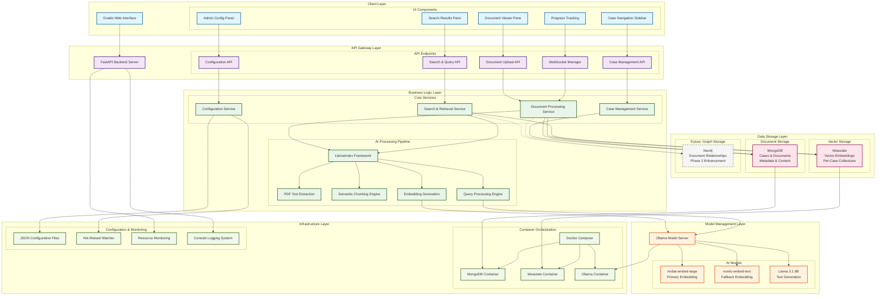

```mermaid
graph TB
    subgraph "Client Layer"
        UI[Gradio Web Interface]
        subgraph "UI Components"
            Sidebar[Case Navigation Sidebar]
            SearchPane[Search Results Pane]
            DocViewer[Document Viewer Pane]
            AdminPanel[Admin Config Panel]
            Progress[Progress Tracking]
        end
    end

    subgraph "API Gateway Layer"
        FastAPI[FastAPI Backend Server]
        subgraph "API Endpoints"
            CaseAPI[Case Management API]
            DocAPI[Document Upload API]
            SearchAPI[Search & Query API]
            ConfigAPI[Configuration API]
            WSManager[WebSocket Manager]
        end
    end

    subgraph "Business Logic Layer"
        subgraph "Core Services"
            CaseService[Case Management Service]
            DocService[Document Processing Service]
            SearchService[Search & Retrieval Service]
            ConfigService[Configuration Service]
        end
        
        subgraph "AI Processing Pipeline"
            LlamaIndex[LlamaIndex Framework]
            PDFProcessor[PDF Text Extraction]
            Chunker[Semantic Chunking Engine]
            EmbedGen[Embedding Generation]
            QueryEngine[Query Processing Engine]
        end
    end

    subgraph "Model Management Layer"
        Ollama[Ollama Model Server]
        subgraph "AI Models"
            MXBai[mxbai-embed-large<br/>Primary Embedding]
            Nomic[nomic-embed-text<br/>Fallback Embedding]
            Llama3[Llama 3.1 8B<br/>Text Generation]
        end
    end

    subgraph "Data Storage Layer"
        subgraph "Document Storage"
            MongoDB[MongoDB<br/>Cases & Documents<br/>Metadata & Content]
        end
        
        subgraph "Vector Storage"
            Weaviate[Weaviate<br/>Vector Embeddings<br/>Per-Case Collections]
        end
        
        subgraph "Future: Graph Storage"
            Neo4j[Neo4j<br/>Document Relationships<br/>Phase 2 Enhancement]
        end
    end

    subgraph "Infrastructure Layer"
        subgraph "Container Orchestration"
            Docker[Docker Compose]
            MongoContainer[MongoDB Container]
            WeaviateContainer[Weaviate Container]
            OllamaContainer[Ollama Container]
        end
        
        subgraph "Configuration & Monitoring"
            ConfigFiles[JSON Configuration Files]
            HotReload[Hot-Reload Watcher]
            ResourceMonitor[Resource Monitoring]
            Logger[Console Logging System]
        end
    end

    %% Client to API connections
    UI --> FastAPI
    Sidebar --> CaseAPI
    SearchPane --> SearchAPI
    DocViewer --> DocAPI
    AdminPanel --> ConfigAPI
    Progress --> WSManager

    %% API to Services connections
    CaseAPI --> CaseService
    DocAPI --> DocService
    SearchAPI --> SearchService
    ConfigAPI --> ConfigService
    WSManager --> DocService

    %% Services to AI Pipeline connections
    DocService --> LlamaIndex
    SearchService --> LlamaIndex
    LlamaIndex --> PDFProcessor
    LlamaIndex --> Chunker
    LlamaIndex --> EmbedGen
    LlamaIndex --> QueryEngine

    %% AI Pipeline to Models connections
    EmbedGen --> Ollama
    QueryEngine --> Ollama
    Ollama --> MXBai
    Ollama --> Nomic
    Ollama --> Llama3

    %% Services to Storage connections
    CaseService --> MongoDB
    DocService --> MongoDB
    DocService --> Weaviate
    SearchService --> Weaviate
    
    %% Future Phase 2 connections (dashed)
    SearchService -.-> Neo4j
    DocService -.-> Neo4j

    %% Configuration connections
    ConfigService --> ConfigFiles
    ConfigService --> HotReload
    FastAPI --> ResourceMonitor
    FastAPI --> Logger

    %% Infrastructure connections
    MongoDB --> MongoContainer
    Weaviate --> WeaviateContainer
    Ollama --> OllamaContainer
    Docker --> MongoContainer
    Docker --> WeaviateContainer
    Docker --> OllamaContainer

    %% Styling
    classDef clientLayer fill:#e1f5fe,stroke:#01579b,stroke-width:2px
    classDef apiLayer fill:#f3e5f5,stroke:#4a148c,stroke-width:2px
    classDef businessLayer fill:#e8f5e8,stroke:#1b5e20,stroke-width:2px
    classDef modelLayer fill:#fff3e0,stroke:#e65100,stroke-width:2px
    classDef storageLayer fill:#fce4ec,stroke:#880e4f,stroke-width:2px
    classDef infraLayer fill:#f1f8e9,stroke:#33691e,stroke-width:2px
    classDef futureFeature fill:#f5f5f5,stroke:#757575,stroke-width:2px,stroke-dasharray: 5 5

    class UI,Sidebar,SearchPane,DocViewer,AdminPanel,Progress clientLayer
    class FastAPI,CaseAPI,DocAPI,SearchAPI,ConfigAPI,WSManager apiLayer
    class CaseService,DocService,SearchService,ConfigService,LlamaIndex,PDFProcessor,Chunker,EmbedGen,QueryEngine businessLayer
    class Ollama,MXBai,Nomic,Llama3 modelLayer
    class MongoDB,Weaviate storageLayer
    class Neo4j futureFeature
    class Docker,MongoContainer,WeaviateContainer,OllamaContainer,ConfigFiles,HotReload,ResourceMonitor,Logger infraLayer

```