# Patexia Legal AI Chatbot - Component Interaction Diagram

## System Component Interactions

This diagram illustrates the complete interaction flow between all components in the Patexia Legal AI Chatbot system, showing data flow, API calls, and real-time communication patterns.

```mermaid
sequenceDiagram
    participant User as 👤 Legal Professional
    participant UI as 🌐 Gradio Interface
    participant WS as 🔌 WebSocket Manager
    participant API as 🚀 FastAPI Gateway
    participant Auth as 🔐 Auth Service
    participant CaseService as 📁 Case Service
    participant DocService as 📄 Document Service
    participant SearchService as 🔍 Search Service
    participant EmbedService as 🧠 Embedding Service
    participant ConfigService as ⚙️ Config Service
    participant DocProcessor as 🔄 Document Processor
    participant PDFProcessor as 📰 PDF Processor
    participant TextChunker as ✂️ Text Chunker
    participant EmbedGen as 🎯 Embedding Generator
    participant QueryEngine as 🤖 Query Engine
    participant Ollama as 🦙 Ollama Server
    participant MXBai as 🧬 mxbai-embed-large
    participant Nomic as 📊 nomic-embed-text
    participant Llama3 as 🦾 Llama 3.1 8B
    participant MongoDB as 🍃 MongoDB
    participant CaseRepo as 🗂️ Case Repository
    participant DocRepo as 📚 Document Repository
    participant Weaviate as 🔗 Weaviate Vector DB
    participant VectorRepo as 🎯 Vector Repository
    participant CollectionMgr as 📋 Collection Manager
    participant Neo4j as 🕸️ Neo4j Graph DB
    participant ConfigWatcher as 👁️ Config Watcher
    participant ResourceMonitor as 📊 Resource Monitor

    %% Case Creation Flow
    rect rgb(240, 248, 255)
        Note over User, ResourceMonitor: Case Creation Workflow
        User->>UI: Create New Case
        UI->>API: POST /api/v1/cases/
        API->>Auth: Validate User Token
        Auth-->>API: Token Valid
        API->>CaseService: create_case(case_data)
        CaseService->>CaseRepo: save_case()
        CaseRepo->>MongoDB: INSERT case document
        MongoDB-->>CaseRepo: case_id generated
        CaseRepo-->>CaseService: Case created
        CaseService->>CollectionMgr: create_case_collection(case_id)
        CollectionMgr->>Weaviate: CREATE collection schema
        Weaviate-->>CollectionMgr: Collection ready
        CollectionMgr-->>CaseService: Vector space prepared
        CaseService-->>API: Case creation successful
        API-->>UI: HTTP 201 + case details
        UI-->>User: Case created confirmation
    end

    %% Document Upload and Processing Flow
    rect rgb(248, 255, 248)
        Note over User, ResourceMonitor: Document Upload & Processing Workflow
        User->>UI: Upload Documents to Case
        UI->>WS: Connect WebSocket for progress
        WS->>DocService: register_progress_listener()
        UI->>API: POST /api/v1/documents/upload/{case_id}
        API->>Auth: Validate permissions
        Auth-->>API: Upload authorized
        API->>DocService: process_documents(files, case_id)
        
        %% Capacity Check
        DocService->>CaseService: check_document_capacity()
        CaseService->>CaseRepo: get_case_document_count()
        CaseRepo->>MongoDB: COUNT documents WHERE case_id
        MongoDB-->>CaseRepo: current_count
        CaseRepo-->>CaseService: Document count
        CaseService->>ConfigService: get_capacity_limits()
        ConfigService-->>CaseService: capacity_config
        CaseService-->>DocService: Capacity check passed
        
        %% Document Processing Pipeline
        DocService->>DocProcessor: process_document_batch()
        DocService->>WS: send_progress("Processing started", 0%)
        
        loop For each document
            DocProcessor->>PDFProcessor: extract_text(pdf_file)
            PDFProcessor->>PDFProcessor: try_direct_extraction()
            alt Direct extraction successful
                PDFProcessor-->>DocProcessor: extracted_text
            else OCR required
                PDFProcessor->>PDFProcessor: perform_ocr()
                PDFProcessor-->>DocProcessor: ocr_text
            end
            
            DocProcessor->>TextChunker: chunk_text(text, strategy="legal")
            TextChunker->>TextChunker: preserve_legal_structure()
            TextChunker-->>DocProcessor: text_chunks[]
            
            DocProcessor->>DocRepo: save_document_metadata()
            DocRepo->>MongoDB: INSERT document + chunks
            MongoDB-->>DocRepo: document_id
            DocRepo-->>DocProcessor: Document saved
            
            DocProcessor->>EmbedGen: generate_embeddings(chunks)
            EmbedGen->>EmbedService: get_embedding_batch()
            EmbedService->>Ollama: POST /api/embeddings
            Ollama->>MXBai: Generate embeddings
            alt MXBai available
                MXBai-->>Ollama: embeddings_1000d
            else Fallback to Nomic
                Ollama->>Nomic: Generate embeddings
                Nomic-->>Ollama: embeddings_768d
            end
            Ollama-->>EmbedService: embedding_vectors
            EmbedService-->>EmbedGen: processed_embeddings
            EmbedGen-->>DocProcessor: embeddings_ready
            
            DocProcessor->>VectorRepo: store_document_vectors()
            VectorRepo->>Weaviate: PUT /v1/objects/batch
            Weaviate-->>VectorRepo: vectors_indexed
            VectorRepo-->>DocProcessor: Indexing complete
            
            DocService->>WS: send_progress("Document processed", progress%)
        end
        
        DocService->>WS: send_progress("Processing complete", 100%)
        DocService-->>API: Processing completed
        API-->>UI: HTTP 200 + processing summary
    end

    %% Search and Retrieval Flow
    rect rgb(255, 248, 240)
        Note over User, ResourceMonitor: Search & Retrieval Workflow
        User->>UI: Enter search query
        UI->>API: POST /api/v1/search/
        API->>Auth: Validate search permissions
        Auth-->>API: Search authorized
        API->>SearchService: hybrid_search(query, case_id, params)
        
        %% Query Processing
        SearchService->>QueryEngine: process_legal_query()
        QueryEngine->>QueryEngine: extract_legal_entities()
        QueryEngine->>QueryEngine: decompose_complex_query()
        QueryEngine-->>SearchService: processed_query_parts
        
        %% Embedding Generation for Query
        SearchService->>EmbedService: embed_query_text()
        EmbedService->>Ollama: POST /api/embeddings
        Ollama->>MXBai: Generate query embedding
        MXBai-->>Ollama: query_vector
        Ollama-->>EmbedService: query_embedding
        EmbedService-->>SearchService: query_vector_ready
        
        %% Hybrid Search Execution
        par Vector Search
            SearchService->>VectorRepo: semantic_search(query_vector)
            VectorRepo->>Weaviate: POST /v1/graphql (nearVector)
            Weaviate-->>VectorRepo: semantic_results[]
            VectorRepo-->>SearchService: vector_matches
        and Keyword Search
            SearchService->>VectorRepo: keyword_search(query_text)
            VectorRepo->>Weaviate: POST /v1/graphql (bm25)
            Weaviate-->>VectorRepo: keyword_results[]
            VectorRepo-->>SearchService: keyword_matches
        end
        
        %% Result Fusion and Ranking
        SearchService->>SearchService: reciprocal_rank_fusion()
        SearchService->>SearchService: apply_legal_filters()
        SearchService->>SearchService: rerank_by_relevance()
        
        %% Document Content Retrieval
        SearchService->>DocRepo: get_document_content(doc_ids)
        DocRepo->>MongoDB: FIND documents WHERE _id IN [...]
        MongoDB-->>DocRepo: document_details[]
        DocRepo-->>SearchService: enriched_results
        
        %% Search History Recording
        SearchService->>DocRepo: save_search_history()
        DocRepo->>MongoDB: INSERT search_log
        MongoDB-->>DocRepo: History saved
        
        SearchService-->>API: search_results + metadata
        API-->>UI: HTTP 200 + search response
        UI-->>User: Display results with highlighting
    end

    %% Configuration Management Flow
    rect rgb(255, 240, 255)
        Note over User, ResourceMonitor: Configuration Management Workflow
        ConfigWatcher->>ConfigWatcher: monitor_config_files()
        ConfigWatcher->>ConfigService: config_file_changed()
        ConfigService->>ConfigService: validate_new_config()
        ConfigService->>ConfigService: apply_hot_reload()
        ConfigService->>EmbedService: update_model_settings()
        ConfigService->>SearchService: update_search_params()
        ConfigService->>DocService: update_processing_limits()
        
        User->>UI: Access Admin Panel
        UI->>API: GET /api/v1/admin/config
        API->>ConfigService: get_current_config()
        ConfigService-->>API: system_configuration
        API-->>UI: Configuration data
        
        User->>UI: Update search parameters
        UI->>API: PUT /api/v1/admin/config/search
        API->>ConfigService: update_search_config()
        ConfigService->>ConfigService: validate_parameters()
        ConfigService->>SearchService: apply_new_settings()
        SearchService-->>ConfigService: Settings applied
        ConfigService-->>API: Update successful
        API-->>UI: Configuration updated
    end

    %% Resource Monitoring Flow
    rect rgb(240, 255, 240)
        Note over User, ResourceMonitor: Resource Monitoring Workflow
        loop Continuous monitoring
            ResourceMonitor->>ResourceMonitor: check_gpu_utilization()
            ResourceMonitor->>ResourceMonitor: check_memory_usage()
            ResourceMonitor->>ResourceMonitor: check_disk_space()
            ResourceMonitor->>Ollama: GET /api/ps (model status)
            Ollama-->>ResourceMonitor: model_metrics
            ResourceMonitor->>MongoDB: ping() (health check)
            MongoDB-->>ResourceMonitor: db_status
            ResourceMonitor->>Weaviate: GET /v1/meta (cluster status)
            Weaviate-->>ResourceMonitor: vector_db_metrics
            
            alt Resource threshold exceeded
                ResourceMonitor->>WS: send_alert("High resource usage")
                WS->>UI: Display resource warning
                ResourceMonitor->>ConfigService: trigger_throttling()
                ConfigService->>DocService: reduce_concurrent_processing()
            end
        end
    end

    %% Error Handling and Recovery Flow
    rect rgb(255, 240, 240)
        Note over User, ResourceMonitor: Error Handling & Recovery Workflow
        alt Document processing failure
            DocProcessor->>DocService: processing_error(doc_id, error)
            DocService->>DocRepo: update_document_status("failed")
            DocRepo->>MongoDB: UPDATE document SET status="failed"
            DocService->>WS: send_error_notification()
            WS->>UI: Display retry option
            
            User->>UI: Retry failed document
            UI->>API: POST /api/v1/documents/{doc_id}/retry
            API->>DocService: retry_document_processing()
            DocService->>DocProcessor: reprocess_document()
        end
        
        alt Model service unavailable
            EmbedService->>Ollama: POST /api/embeddings
            Ollama-->>EmbedService: HTTP 503 Service Unavailable
            EmbedService->>EmbedService: switch_to_fallback_model()
            EmbedService->>Ollama: POST /api/embeddings (nomic-embed-text)
            Ollama->>Nomic: Generate embeddings
            Nomic-->>Ollama: fallback_embeddings
            Ollama-->>EmbedService: Success with fallback
        end
        
        alt Database connection issues
            CaseRepo->>MongoDB: FIND case
            MongoDB-->>CaseRepo: Connection timeout
            CaseRepo->>CaseRepo: retry_with_backoff()
            CaseRepo->>MongoDB: FIND case (retry)
            MongoDB-->>CaseRepo: Case data
        end
    end

    %% WebSocket Real-time Communication
    rect rgb(245, 245, 255)
        Note over User, ResourceMonitor: WebSocket Real-time Communication
        WS->>WS: manage_connections()
        WS->>WS: broadcast_to_case_users()
        WS->>WS: send_user_specific_updates()
        
        loop Active WebSocket connections
            DocService->>WS: processing_update(progress_data)
            SearchService->>WS: search_completed(results_summary)
            ConfigService->>WS: config_changed(new_settings)
            ResourceMonitor->>WS: resource_alert(metrics)
            WS->>UI: Real-time updates
            UI->>User: Live progress/notifications
        end
    end
```

## Component Interaction Summary

### 🔄 **Primary Data Flows**

1. **Case Creation**: User → UI → API → CaseService → MongoDB + Weaviate collection setup
2. **Document Processing**: Upload → Validation → PDF/Text extraction → Chunking → Embedding → Vector storage
3. **Search Operations**: Query → Embedding → Hybrid search → Result fusion → Document retrieval → Response
4. **Configuration Management**: File watching → Validation → Hot reload → Service updates
5. **Real-time Updates**: WebSocket connections → Progress tracking → Error notifications → Status updates

### 🏗️ **Key Interaction Patterns**

- **Service Layer Orchestration**: Services coordinate multiple repositories and processors
- **Async Processing**: Document processing runs asynchronously with WebSocket progress updates
- **Fallback Mechanisms**: Automatic model switching when primary services unavailable
- **Resource Management**: Continuous monitoring with automatic throttling and alerts
- **Error Recovery**: Comprehensive retry mechanisms with user-friendly error reporting

### 🔗 **Critical Integration Points**

- **Ollama Model Gateway**: Centralized access to all AI models with load balancing
- **WebSocket Manager**: Real-time communication hub for all async operations
- **Configuration Service**: Hot-reload capability affecting all system components
- **Repository Pattern**: Consistent data access layer across MongoDB, Weaviate, and Neo4j
- **Authentication Flow**: Centralized security validation for all API operations

This diagram demonstrates the sophisticated interaction patterns that enable the system's real-time responsiveness, reliability, and scalability for legal document processing and search operations.